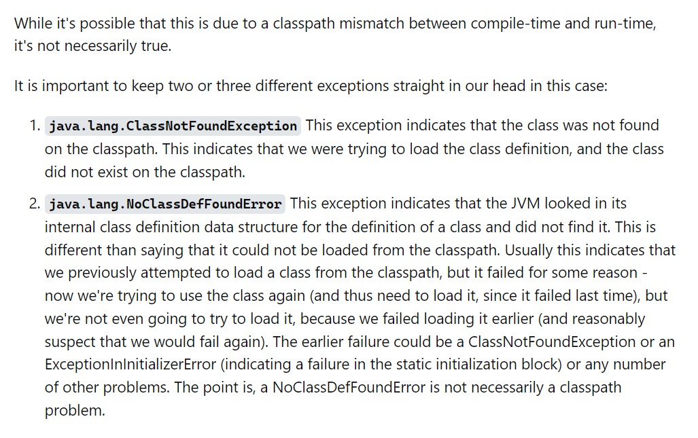
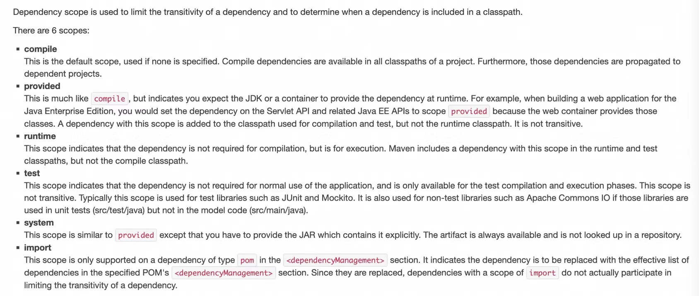

# NoClassDefFoundError问题

参考资料

stackoverflow的完整解答：https://stackoverflow.com/questions/34413/why-am-i-getting-a-noclassdeffounderror-in-java

maven官方文档：https://maven.apache.org/guides/introduction/introduction-to-dependency-mechanism.html#Dependency_Scope

今天在配置spring定时任务时，编译成功，但是机器一直无法部署成功，打开日志看了下，提示NoClassDefFoundError。

经过简单搜索，原因大致如下（截图自stack overflow）：

###### 

可以看出，该异常多是因为编译器和运行期的类可见性不同。

好，打开看看这个报错的是啥玩意儿吧。

###### 

报错的类是xxx.xxx.StringUtils。这里的关系是，应用A依赖B，B依赖C，C包含StringUtils类。

直接在应用里引用这个类，发现这个类所在的jar包确实没引进来。打开B的pom文件，可以看到对应的依赖中，scope属性值为provided，破案了，现在我们拿出maven的官方文档：

###### 

scope为provided的依赖仅在编译期可用，在运行时不可用（一般由容器提供）。

个人理解这样的目的是由容器提供统一版本的依赖。

（我的第一反应其实是：防止整个应用的代码被别人偷了直接运行。）

